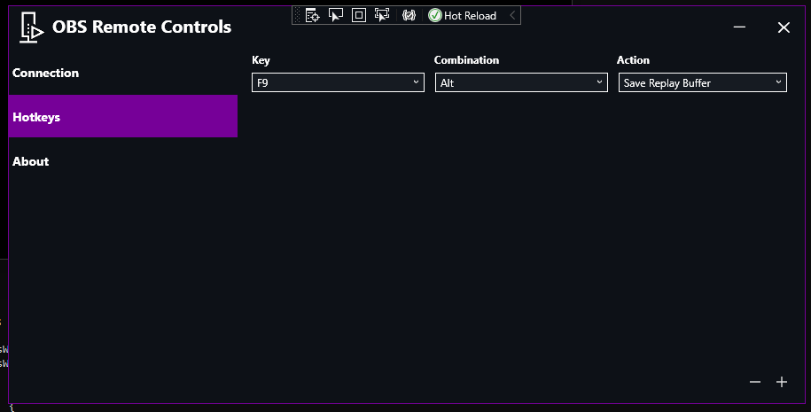

# OBS-Remote-Controls
This is a basic program for controlling your remote OBS instance. Currently the app supports basic hotkey functionality for: recording, streaming and replay buffer.  
Desktop notifications can be disabled from the about tab.
  